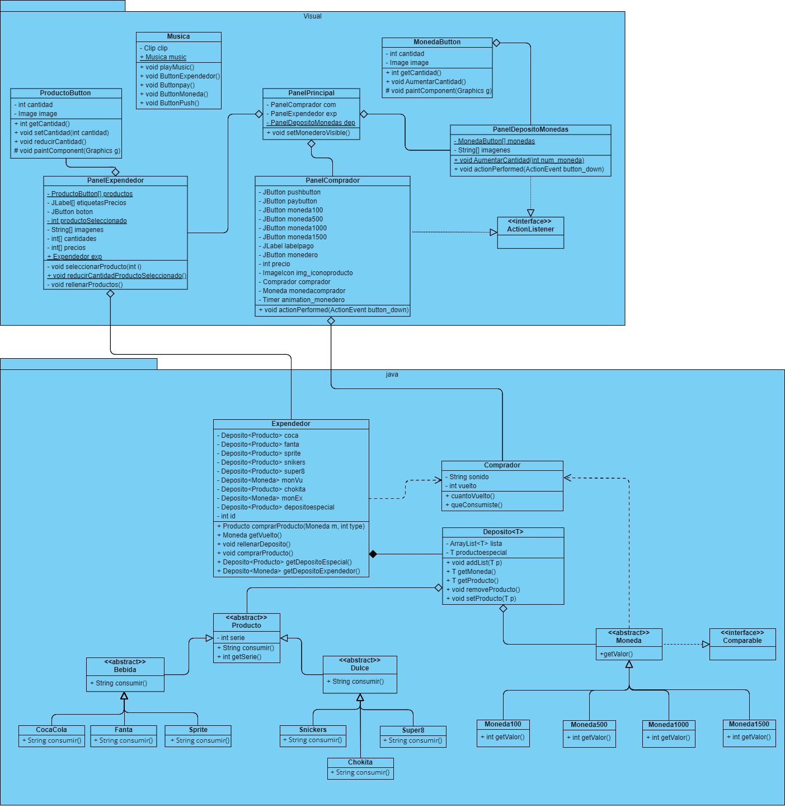
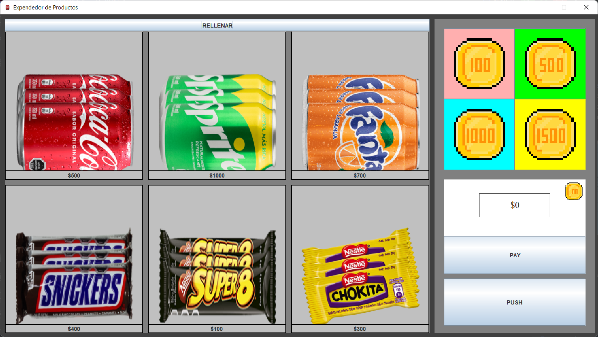
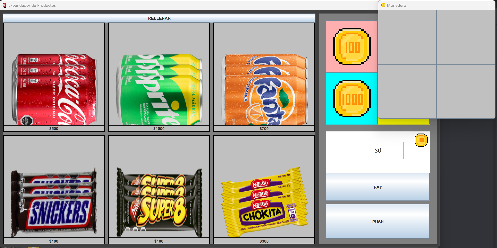

# Tarea-3-DOO
Se ha añadido una interfaz gráfica (GUI) a la [Tarea 1](https://github.com/joaqsandoval04/Tarea-1-DOO), permite al usuario interactuar de manera más intuitiva con el expendedor.
La GUI incluye botones para la selección de productos y la introducción de monedas, así como indicadores visuales que 
muestran mensajes de confirmación, errores y la selección del producto.

## Screenshots

Nota: Al presionar la moneda a la derecha del precio ingresado, el depósito de monedas aparecerá.

## Autores
- Daniel Ignacio Aburto Rivera ([@daaburto](https://github.com/daaburto))
- Joaquín Hernán Sandoval Reyes ([@joaqsandoval04](https://github.com/joaqsandoval04))